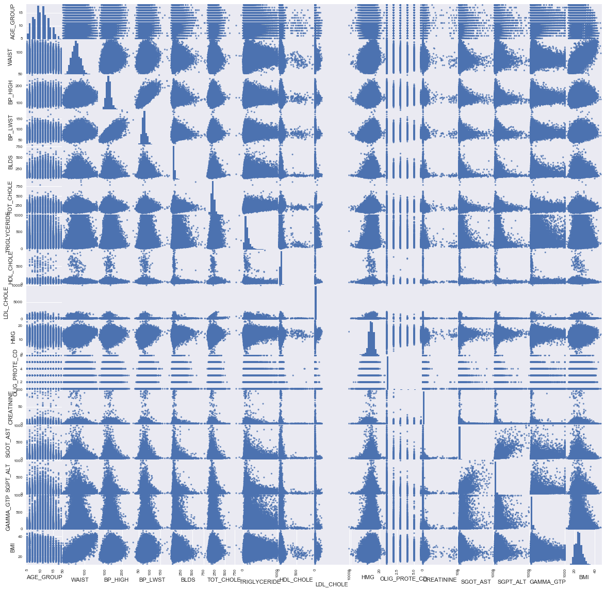
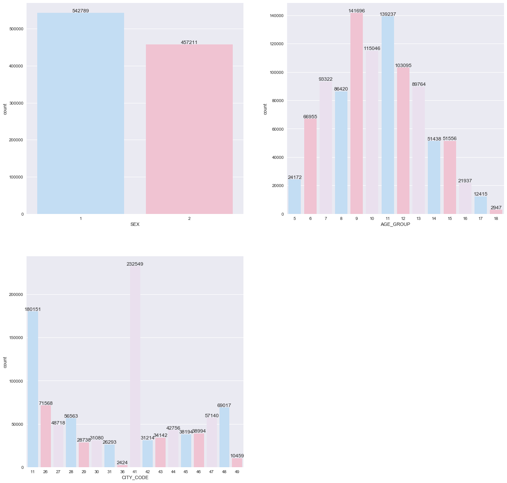
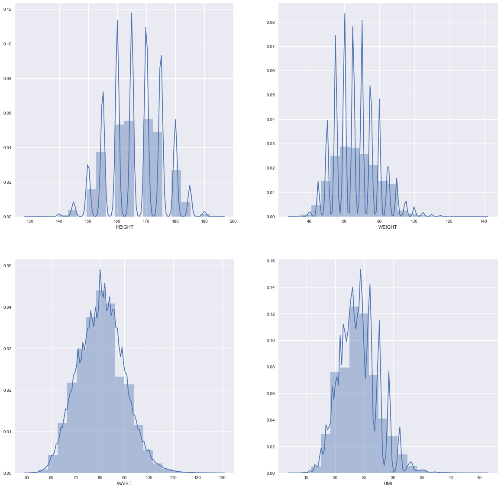
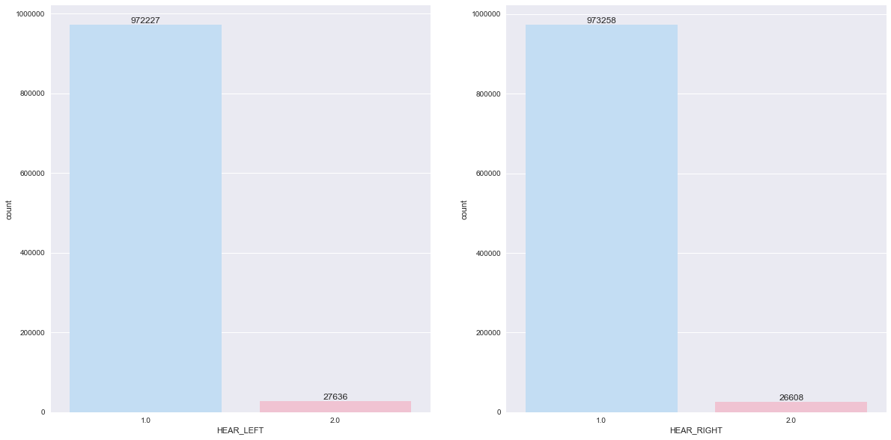
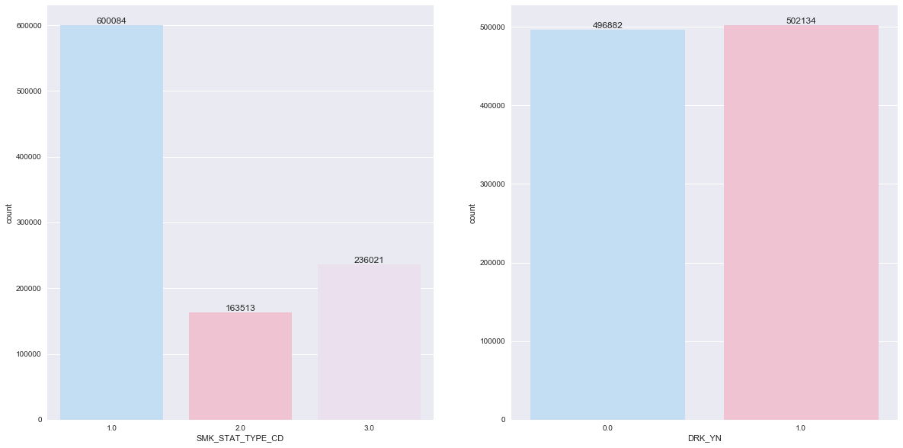
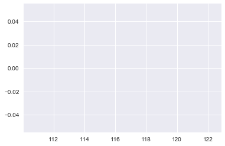

# 1. Data Exporation

### Import library and data


```python
import pandas as pd
import numpy as np
import seaborn as sns
import matplotlib.pyplot as plt
%matplotlib inline
```


```python
medical = pd.read_csv("NHIS유서_OPEN_GJ_2014.CSV", encoding="CP949")
```

### Check data


```python
medical.head(10)
```


<div>
<style>
    .dataframe thead tr:only-child th {
        text-align: right;
    }

    .dataframe thead th {
        text-align: left;
    }

    .dataframe tbody tr th {
        vertical-align: top;
    }
</style>
<table border="1" class="dataframe">
  <thead>
    <tr style="text-align: right;">
      <th></th>
      <th>기준년도</th>
      <th>가입자일련번호</th>
      <th>성별코드</th>
      <th>연령대코드(5세단위)</th>
      <th>시도코드</th>
      <th>신장(5Cm단위)</th>
      <th>체중(5Kg 단위)</th>
      <th>허리둘레</th>
      <th>시력(좌)</th>
      <th>시력(우)</th>
      <th>...</th>
      <th>혈청크레아티닌</th>
      <th>(혈청지오티)AST</th>
      <th>(혈청지오티)ALT</th>
      <th>감마지티피</th>
      <th>흡연상태</th>
      <th>음주여부</th>
      <th>구강검진 수검여부</th>
      <th>치아우식증유무</th>
      <th>치석유무</th>
      <th>데이터 기준일자</th>
    </tr>
  </thead>
  <tbody>
    <tr>
      <th>0</th>
      <td>2014</td>
      <td>1</td>
      <td>1</td>
      <td>6</td>
      <td>42</td>
      <td>180</td>
      <td>75</td>
      <td>79</td>
      <td>1.5</td>
      <td>1.2</td>
      <td>...</td>
      <td>1.2</td>
      <td>31</td>
      <td>18</td>
      <td>23</td>
      <td>3.0</td>
      <td>0.0</td>
      <td>1</td>
      <td>0.0</td>
      <td>0.0</td>
      <td>20161220</td>
    </tr>
    <tr>
      <th>1</th>
      <td>2014</td>
      <td>2</td>
      <td>2</td>
      <td>18</td>
      <td>41</td>
      <td>150</td>
      <td>65</td>
      <td>79</td>
      <td>0.1</td>
      <td>0.1</td>
      <td>...</td>
      <td>0.8</td>
      <td>11</td>
      <td>4</td>
      <td>15</td>
      <td>1.0</td>
      <td>1.0</td>
      <td>0</td>
      <td>NaN</td>
      <td>NaN</td>
      <td>20161220</td>
    </tr>
    <tr>
      <th>2</th>
      <td>2014</td>
      <td>3</td>
      <td>1</td>
      <td>12</td>
      <td>41</td>
      <td>170</td>
      <td>70</td>
      <td>95</td>
      <td>0.8</td>
      <td>1.0</td>
      <td>...</td>
      <td>0.6</td>
      <td>138</td>
      <td>73</td>
      <td>112</td>
      <td>3.0</td>
      <td>1.0</td>
      <td>1</td>
      <td>0.0</td>
      <td>1.0</td>
      <td>20161220</td>
    </tr>
    <tr>
      <th>3</th>
      <td>2014</td>
      <td>4</td>
      <td>2</td>
      <td>11</td>
      <td>41</td>
      <td>165</td>
      <td>80</td>
      <td>104</td>
      <td>0.8</td>
      <td>0.2</td>
      <td>...</td>
      <td>0.9</td>
      <td>19</td>
      <td>14</td>
      <td>21</td>
      <td>1.0</td>
      <td>0.0</td>
      <td>1</td>
      <td>0.0</td>
      <td>1.0</td>
      <td>20161220</td>
    </tr>
    <tr>
      <th>4</th>
      <td>2014</td>
      <td>5</td>
      <td>1</td>
      <td>6</td>
      <td>44</td>
      <td>175</td>
      <td>75</td>
      <td>81</td>
      <td>1.5</td>
      <td>1.5</td>
      <td>...</td>
      <td>1.0</td>
      <td>32</td>
      <td>39</td>
      <td>98</td>
      <td>1.0</td>
      <td>1.0</td>
      <td>1</td>
      <td>NaN</td>
      <td>1.0</td>
      <td>20161220</td>
    </tr>
    <tr>
      <th>5</th>
      <td>2014</td>
      <td>6</td>
      <td>2</td>
      <td>11</td>
      <td>47</td>
      <td>155</td>
      <td>60</td>
      <td>88</td>
      <td>0.6</td>
      <td>0.8</td>
      <td>...</td>
      <td>0.7</td>
      <td>25</td>
      <td>27</td>
      <td>27</td>
      <td>3.0</td>
      <td>0.0</td>
      <td>0</td>
      <td>NaN</td>
      <td>NaN</td>
      <td>20161220</td>
    </tr>
    <tr>
      <th>6</th>
      <td>2014</td>
      <td>7</td>
      <td>1</td>
      <td>11</td>
      <td>45</td>
      <td>165</td>
      <td>50</td>
      <td>66</td>
      <td>0.8</td>
      <td>0.9</td>
      <td>...</td>
      <td>1.0</td>
      <td>21</td>
      <td>8</td>
      <td>55</td>
      <td>3.0</td>
      <td>0.0</td>
      <td>0</td>
      <td>NaN</td>
      <td>NaN</td>
      <td>20161220</td>
    </tr>
    <tr>
      <th>7</th>
      <td>2014</td>
      <td>8</td>
      <td>2</td>
      <td>11</td>
      <td>41</td>
      <td>145</td>
      <td>55</td>
      <td>93</td>
      <td>0.9</td>
      <td>0.9</td>
      <td>...</td>
      <td>1.2</td>
      <td>34</td>
      <td>16</td>
      <td>175</td>
      <td>1.0</td>
      <td>1.0</td>
      <td>0</td>
      <td>NaN</td>
      <td>NaN</td>
      <td>20161220</td>
    </tr>
    <tr>
      <th>8</th>
      <td>2014</td>
      <td>9</td>
      <td>2</td>
      <td>18</td>
      <td>41</td>
      <td>140</td>
      <td>35</td>
      <td>78</td>
      <td>0.2</td>
      <td>0.1</td>
      <td>...</td>
      <td>0.5</td>
      <td>30</td>
      <td>10</td>
      <td>10</td>
      <td>1.0</td>
      <td>1.0</td>
      <td>0</td>
      <td>NaN</td>
      <td>NaN</td>
      <td>20161220</td>
    </tr>
    <tr>
      <th>9</th>
      <td>2014</td>
      <td>10</td>
      <td>1</td>
      <td>7</td>
      <td>26</td>
      <td>175</td>
      <td>80</td>
      <td>90</td>
      <td>0.6</td>
      <td>0.4</td>
      <td>...</td>
      <td>0.7</td>
      <td>25</td>
      <td>21</td>
      <td>18</td>
      <td>1.0</td>
      <td>0.0</td>
      <td>0</td>
      <td>NaN</td>
      <td>NaN</td>
      <td>20161220</td>
    </tr>
  </tbody>
</table>
<p>10 rows × 31 columns</p>
</div>


```python
medical.columns
```


    Index(['기준년도', '가입자일련번호', '성별코드', '연령대코드(5세단위)', '시도코드', '신장(5Cm단위)',
           '체중(5Kg 단위)', '허리둘레', '시력(좌)', '시력(우)', '청력(좌)', '청력(우)', '수축기혈압',
           '이완기혈압', '식전혈당(공복혈당)', '총콜레스테롤', '트리글리세라이드', 'HDL콜레스테롤', 'LDL콜레스테롤',
           '혈색소', '요단백', '혈청크레아티닌', '(혈청지오티)AST', '(혈청지오티)ALT', '감마지티피', '흡연상태',
           '음주여부', '구강검진 수검여부', '치아우식증유무', '치석유무', '데이터 기준일자'],
          dtype='object')


### Change the name of variables

<table border=1 align="center">
<tr> <th>Variable Name in Korean</th> <th>Variable Name in English</th> <th>Detailed Explain</th> </tr>
<tr> <td>기준년도</td> <td>YEAR</td> <td></td> </tr>
<tr> <td>가입자일련번호</td> <td>ID</td> <td></td> </tr>
<tr> <td>성별코드</td> <td>SEX</td> <td>1 : male , 2 : female</td> </tr>
<tr> <td>연령대코드(5세단위)</td> <td>AGE_GROUP</td> 
     <td><table>
         <tr><td>1</td><td>20-24</td><td>8</td><td>55-59</td></tr>
         <tr><td>2</td><td>25-29</td><td>9</td><td>60-64</td></tr>
         <tr><td>3</td><td>30-34</td><td>10</td><td>65-69</td></tr>
         <tr><td>4</td><td>35-39</td><td>11</td><td>70-74</td></tr>
         <tr><td>5</td><td>40-44</td><td>12</td><td>75-79</td></tr>
         <tr><td>6</td><td>45-49</td><td>13</td><td>80-84</td></tr>
         <tr><td>7</td><td>50-54</td><td>14</td><td>85+</td></tr>
     </table></td> </tr>
<tr> <td>시도코드</td> <td>CITY_CODE</td> 
     <td><table>
         <tr><td>11</td><td>서울특별시</td><td>41</td><td>경기도</td></tr>
         <tr><td>26</td><td>부산광역시</td><td>42</td><td>강원도</td></tr>
         <tr><td>27</td><td>대구광역시</td><td>43</td><td>충청북도</td></tr>
         <tr><td>28</td><td>인천광역시</td><td>44</td><td>충청남도</td></tr>
         <tr><td>29</td><td>광주광역시</td><td>45</td><td>전라북도</td></tr>
         <tr><td>30</td><td>대전광역시</td><td>46</td><td>전라남도</td></tr>
         <tr><td>31</td><td>울산광역시</td><td>47</td><td>경상북도</td></tr>
         <tr><td>36</td><td>세종특별자치시</td><td>48</td><td>경상남도</td></tr>
         <tr><td></td><td></td><td>49</td><td>제주특별자치도</td></tr>
     </table></td> </tr>
<tr> <td>신장</td> <td>HEIGHT</td> <td>unit : 5cm</td> </tr>
<tr> <td>체중</td> <td>WEIGHT</td> <td>unit : 5kg</td> </tr>
<tr> <td>허리둘레[cm]</td> <td>WAIST</td> <td></td> </tr>
<tr> <td>시력(좌)</td> <td>SIGHT_LEFT</td> <td>9.9 : Blindness</td> </tr>
<tr> <td>시력(우)</td> <td>SIGHT_RIGHT</td> <td>9.9 : Blindness</td> </tr>
<tr> <td>청력(좌)</td> <td>HEAR_LEFT</td> <td>1 : normal , 2 : anormal</td> </tr>
<tr> <td>청력(우)</td> <td>HEAR_RIGHT</td> <td>1 : normal , 2 : anormal</td> </tr>
<tr> <td>수출기혈압[mmHg]</td> <td>BP_HIGH</td> <td>Maximum Blood Pressure</td> </tr>
<tr> <td>이완기혈압[mmHg]</td> <td>BP_LWST</td> <td>Minimum Blood Pressure</td> </tr>
<tr> <td>식전혈당(공복혈당)[mg/dL]</td> <td>BLDS</td> <td>The concentration level of glucose in each 100 ml of blood</td> </tr>
<tr> <td>총콜레스테롤[mg/dL]</td> <td>TOT_CHOLE</td> <td></td> </tr>
<tr> <td>트리글리세라이드[mg/dL]</td> <td>TRIGLYCERIDE</td> 
     <td>Fatty acids produced by the breakdown of triglyceride<br>normal value : 150-250</td> </tr>
<tr> <td>HDL콜레스테롤[mg/dL]</td> <td>HDL_CHOLE</td> 
     <td>Cholesterol in HDL (high-density lipoprotein)<br>normal value : 30-65</td> </tr>
<tr> <td>LDL콜레스테롤[mg/dL]</td> <td>LDL_CHOLE</td> 
     <td>Cholesterol in LDL (low-density lipoprotein)<br>normal value : less than 170</td> </tr>
<tr> <td>혈색소[g/dL]</td> <td>HMG</td> <td>혈액이나 혈구 속에 존재하는 색소단백</td> </tr>
<tr> <td>요단백</td> <td>OLIG_PROTE_CD</td> <td>The protein mixture in the urine<br>1 : - , 2 : +- , 3 : +1 , 4 : +2 , 5 : +3 , 6 : +4</td> </tr>
<tr> <td>혈청크레아티닌[mg/dL]</td> <td>CREATININE</td> <td>콩팥 기능 상태의 변동<br>정상치 0.8-1.7</td> </tr>
<tr> <td>(혈청지오티)AST[IU/dL]</td> <td>SGOT_AST</td> <td>간 기능을 나타내는 혈액 검사상의 수치<br>간세폰 이외의 심장, 신장, 뇌, 근육 등에도 존재하는 효소<br>정상치 0-40</td> </tr>
<tr> <td>(혈청지피티)ALT[IU/L]</td> <td>SGPT_ALT</td> <td>간 기능을 나타내는 혈액 검사상의 수치<br>간세포 안에 존재하는 효소<br>정상치 0-40</td> </tr>
<tr> <td>감마지티피[IU/L]</td> <td>GAMMA_GTP</td> <td>간 기능을 나타내는 혈액 검사상의 수치<br>간 내의 쓸개관에 존재하는 효소<br>정상치 남성 11-63, 여성 8-35</td> </tr>
<tr> <td>흡연상태</td> <td>SMK_STAT_TYPE_CD</td> <td>1 : 피우지 않는다 , 2 : 이전에 피웠으나 끊었다 , 3 : 현재도 피우고 있다</td> </tr>
<tr> <td>음주여부</td> <td>DRK_YN</td> <td>0 : 마시지 않는다 , 1: 마신다</td> </tr>
<tr> <td>구강검진 수검여부</td> <td>HCHK_OE_INSPEC_YN</td> <td>0 : 미수검 , 1: 수검</td> </tr>
<tr> <td>치아우식증유무</td> <td>CRS_YN</td> <td>0 : 없음 , 1: 있음</td> </tr>
<tr> <td>치석유무</td> <td>TTR_YN</td> <td>0 : 없음 , 1: 있음</td> </tr>
<tr> <td>데이터 기준일자</td> <td>DATA_STD_DT</td> <td></td> </tr>
</table>


```python
names = ['YEAR', 'ID', 'SEX', 'AGE_GROUP', 'CITY_CODE', 
         'HEIGHT', 'WEIGHT', 'WAIST', 'SIGHT_LEFT', 'SIGHT_RIGHT', 
         'HEAR_LEFT', 'HEAR_RIGHT', 'BP_HIGH', 'BP_LWST', 'BLDS', 
         'TOT_CHOLE', 'TRIGLYCERIDE', 'HDL_CHOLE', 'LDL_CHOLE', 'HMG', 
         'OLIG_PROTE_CD', 'CREATININE', 'SGOT_AST', 'SGPT_ALT', 'GAMMA_GTP', 
         'SMK_STAT_TYPE_CD', 'DRK_YN', 'HCHK_OE_INSPEC_YN', 
         'CRS_YN', 'TTR_YN', 'DATA_STD_DT']
medical
```

### Check data structure


```python
medical.shape
```


    (1000000, 31)


```python
medical.info()
```

    <class 'pandas.core.frame.DataFrame'>
    RangeIndex: 1000000 entries, 0 to 999999
    Data columns (total 31 columns):
    YEAR                 1000000 non-null int64
    ID                   1000000 non-null int64
    SEX                  1000000 non-null int64
    AGE_GROUP            1000000 non-null int64
    CITY_CODE            1000000 non-null int64
    HEIGHT               1000000 non-null int64
    WEIGHT               1000000 non-null int64
    WAIST                1000000 non-null int64
    SIGHT_LEFT           999838 non-null float64
    SIGHT_RIGHT          999840 non-null float64
    HEAR_LEFT            999863 non-null float64
    HEAR_RIGHT           999866 non-null float64
    BP_HIGH              1000000 non-null int64
    BP_LWST              1000000 non-null int64
    BLDS                 1000000 non-null int64
    TOT_CHOLE            1000000 non-null int64
    TRIGLYCERIDE         1000000 non-null int64
    HDL_CHOLE            1000000 non-null int64
    LDL_CHOLE            995758 non-null float64
    HMG                  1000000 non-null float64
    OLIG_PROTE_CD        995661 non-null float64
    CREATININE           1000000 non-null float64
    SGOT_AST             1000000 non-null int64
    SGPT_ALT             1000000 non-null int64
    GAMMA_GTP            1000000 non-null int64
    SMK_STAT_TYPE_CD     999618 non-null float64
    DRK_YN               999016 non-null float64
    HCHK_OE_INSPEC_YN    1000000 non-null int64
    CRS_YN               110048 non-null float64
    TTR_YN               382722 non-null float64
    DATA_STD_DT          1000000 non-null int64
    dtypes: float64(12), int64(19)
    memory usage: 236.5 MB
    


```python
medical.describe()
```


<div>
<style>
    .dataframe thead tr:only-child th {
        text-align: right;
    }

    .dataframe thead th {
        text-align: left;
    }

    .dataframe tbody tr th {
        vertical-align: top;
    }
</style>
<table border="1" class="dataframe">
  <thead>
    <tr style="text-align: right;">
      <th></th>
      <th>HCHK_YEAR</th>
      <th>IDV_ID</th>
      <th>SEX</th>
      <th>AGE_GROUP</th>
      <th>SIDO</th>
      <th>HEIGHT</th>
      <th>WEIGHT</th>
      <th>WAIST</th>
      <th>SIGHT_LEFT</th>
      <th>SIGHT_RIGHT</th>
      <th>...</th>
      <th>CREATININE</th>
      <th>SGOT_AST</th>
      <th>SGOT_ALT</th>
      <th>GAMMA_GTP</th>
      <th>SMK_STAT_TYPE_CD</th>
      <th>DRK_YN</th>
      <th>HCHK_OE_INSPEC_YN</th>
      <th>CRS_YN</th>
      <th>TTR_YN</th>
      <th>DATA_STD_DT</th>
    </tr>
  </thead>
  <tbody>
    <tr>
      <th>count</th>
      <td>1000000.0</td>
      <td>1000000.000000</td>
      <td>1000000.000000</td>
      <td>1000000.000000</td>
      <td>1000000.000000</td>
      <td>1000000.000000</td>
      <td>1000000.000000</td>
      <td>1000000.000000</td>
      <td>999838.000000</td>
      <td>999840.000000</td>
      <td>...</td>
      <td>1000000.000000</td>
      <td>1000000.000000</td>
      <td>1000000.000000</td>
      <td>1000000.000000</td>
      <td>999618.000000</td>
      <td>999016.000000</td>
      <td>1000000.000000</td>
      <td>110048.0</td>
      <td>382722.000000</td>
      <td>1000000.0</td>
    </tr>
    <tr>
      <th>mean</th>
      <td>2014.0</td>
      <td>500000.500000</td>
      <td>1.457211</td>
      <td>10.337172</td>
      <td>33.627936</td>
      <td>166.307190</td>
      <td>66.610625</td>
      <td>80.516598</td>
      <td>0.984893</td>
      <td>0.981145</td>
      <td>...</td>
      <td>0.886300</td>
      <td>25.400075</td>
      <td>25.071998</td>
      <td>36.413858</td>
      <td>1.635798</td>
      <td>0.502629</td>
      <td>0.405838</td>
      <td>0.0</td>
      <td>0.533575</td>
      <td>20161220.0</td>
    </tr>
    <tr>
      <th>std</th>
      <td>0.0</td>
      <td>288675.278933</td>
      <td>0.498166</td>
      <td>2.819087</td>
      <td>12.721441</td>
      <td>9.335261</td>
      <td>12.181895</td>
      <td>9.329093</td>
      <td>0.631128</td>
      <td>0.622700</td>
      <td>...</td>
      <td>0.665678</td>
      <td>15.863441</td>
      <td>20.954440</td>
      <td>49.121305</td>
      <td>0.838917</td>
      <td>0.499993</td>
      <td>0.491054</td>
      <td>0.0</td>
      <td>0.498872</td>
      <td>0.0</td>
    </tr>
    <tr>
      <th>min</th>
      <td>2014.0</td>
      <td>1.000000</td>
      <td>1.000000</td>
      <td>5.000000</td>
      <td>11.000000</td>
      <td>130.000000</td>
      <td>30.000000</td>
      <td>51.000000</td>
      <td>0.100000</td>
      <td>0.100000</td>
      <td>...</td>
      <td>0.100000</td>
      <td>1.000000</td>
      <td>1.000000</td>
      <td>1.000000</td>
      <td>1.000000</td>
      <td>0.000000</td>
      <td>0.000000</td>
      <td>0.0</td>
      <td>0.000000</td>
      <td>20161220.0</td>
    </tr>
    <tr>
      <th>25%</th>
      <td>2014.0</td>
      <td>250000.750000</td>
      <td>1.000000</td>
      <td>8.000000</td>
      <td>26.000000</td>
      <td>160.000000</td>
      <td>60.000000</td>
      <td>74.000000</td>
      <td>0.700000</td>
      <td>0.700000</td>
      <td>...</td>
      <td>0.700000</td>
      <td>19.000000</td>
      <td>14.000000</td>
      <td>15.000000</td>
      <td>1.000000</td>
      <td>0.000000</td>
      <td>0.000000</td>
      <td>0.0</td>
      <td>0.000000</td>
      <td>20161220.0</td>
    </tr>
    <tr>
      <th>50%</th>
      <td>2014.0</td>
      <td>500000.500000</td>
      <td>1.000000</td>
      <td>10.000000</td>
      <td>41.000000</td>
      <td>165.000000</td>
      <td>65.000000</td>
      <td>81.000000</td>
      <td>1.000000</td>
      <td>1.000000</td>
      <td>...</td>
      <td>0.900000</td>
      <td>22.000000</td>
      <td>20.000000</td>
      <td>23.000000</td>
      <td>1.000000</td>
      <td>1.000000</td>
      <td>0.000000</td>
      <td>0.0</td>
      <td>1.000000</td>
      <td>20161220.0</td>
    </tr>
    <tr>
      <th>75%</th>
      <td>2014.0</td>
      <td>750000.250000</td>
      <td>2.000000</td>
      <td>12.000000</td>
      <td>44.000000</td>
      <td>175.000000</td>
      <td>75.000000</td>
      <td>87.000000</td>
      <td>1.200000</td>
      <td>1.200000</td>
      <td>...</td>
      <td>1.000000</td>
      <td>28.000000</td>
      <td>29.000000</td>
      <td>39.000000</td>
      <td>2.000000</td>
      <td>1.000000</td>
      <td>1.000000</td>
      <td>0.0</td>
      <td>1.000000</td>
      <td>20161220.0</td>
    </tr>
    <tr>
      <th>max</th>
      <td>2014.0</td>
      <td>1000000.000000</td>
      <td>2.000000</td>
      <td>18.000000</td>
      <td>49.000000</td>
      <td>195.000000</td>
      <td>140.000000</td>
      <td>129.000000</td>
      <td>9.900000</td>
      <td>9.900000</td>
      <td>...</td>
      <td>98.000000</td>
      <td>999.000000</td>
      <td>999.000000</td>
      <td>999.000000</td>
      <td>3.000000</td>
      <td>1.000000</td>
      <td>1.000000</td>
      <td>0.0</td>
      <td>1.000000</td>
      <td>20161220.0</td>
    </tr>
  </tbody>
</table>
<p>8 rows × 31 columns</p>
</div>


### Copy data


```python
medical2 = medical.copy()
```

### Remove unnecessary variables


```python
del medical2['YEAR']
del medical2['DATA_STD_DT']
del medical2['HCHK_OE_INSPEC_YN']
del medical2['TTR_YN']
del medical2['CRS_YN']
```

### Create derived variables

BMI


```python
medical2['BMI'] = np.nan
medical2['BMI'] = medical2['WEIGHT'] / np.square( medical2['HEIGHT'] * 0.01 )
```


```python
medical2['BMI']
```


    0         23.148148
    1         28.888889
    2         24.221453
    3         29.384757
    4         24.489796
    5         24.973985
    6         18.365473
    7         26.159334
    8         17.857143
    9         26.122449
    10        25.510204
    11        19.024970
    12        22.491349
    13        22.038567
    14        17.578125
    15        20.811655
    16        14.692378
    17        21.403092
    18        20.710059
    19        22.857143
    20        22.959184
    21        21.403092
    22        22.491349
    23        24.973985
    24        22.857143
    25        23.875115
    26        28.888889
    27        24.973985
    28        26.122449
    29        29.136316
                ...    
    999970    25.951557
    999971    20.452885
    999972    22.857143
    999973    24.444444
    999974    21.604938
    999975    26.122449
    999976    21.484375
    999977    24.221453
    999978    31.250000
    999979    24.221453
    999980    18.365473
    999981    25.390625
    999982    23.148148
    999983    19.031142
    999984    25.711662
    999985    24.691358
    999986    22.038567
    999987    20.761246
    999988    23.875115
    999989    28.888889
    999990    27.548209
    999991    22.857143
    999992    25.951557
    999993    21.484375
    999994    20.761246
    999995    21.484375
    999996    20.000000
    999997    18.365473
    999998    23.437500
    999999    31.250000
    Name: BMI, Length: 1000000, dtype: float64


BMI_STATE

https://ko.wikipedia.org/wiki/%EC%B2%B4%EC%A7%88%EB%9F%89_%EC%A7%80%EC%88%98


```python
medical2['BMI_STATE'] = np.nan
medical2['BMI_STATE'].loc[(medical2['BMI'] >= 20) & (medical2['BMI'] < 25)] = 'normal'
medical2['BMI_STATE'].loc[(medical2['BMI'] >= 25) & (medical2['BMI'] < 30)] = 'overweight'
medical2['BMI_STATE'].loc[(medical2['BMI'] >= 30) & (medical2['BMI'] < 40)] = 'obesity'
medical2['BMI_STATE'].loc[medical2['BMI'] >= 40] = 'extreme obesity'
medical2['BMI_STATE'].loc[medical2['BMI'] < 20] = 'lowweight'
```

    C:\ProgramData\Anaconda3\lib\site-packages\pandas\core\indexing.py:179: SettingWithCopyWarning: 
    A value is trying to be set on a copy of a slice from a DataFrame
    
    See the caveats in the documentation: http://pandas.pydata.org/pandas-docs/stable/indexing.html#indexing-view-versus-copy
      self._setitem_with_indexer(indexer, value)
    


```python
medical2['BMI_STATE']

```


    0             normal
    1         overweight
    2             normal
    3         overweight
    4             normal
    5             normal
    6          lowweight
    7         overweight
    8          lowweight
    9         overweight
    10        overweight
    11         lowweight
    12            normal
    13            normal
    14         lowweight
    15            normal
    16         lowweight
    17            normal
    18            normal
    19            normal
    20            normal
    21            normal
    22            normal
    23            normal
    24            normal
    25            normal
    26        overweight
    27            normal
    28        overweight
    29        overweight
                 ...    
    999970    overweight
    999971        normal
    999972        normal
    999973        normal
    999974        normal
    999975    overweight
    999976        normal
    999977        normal
    999978       obesity
    999979        normal
    999980     lowweight
    999981    overweight
    999982        normal
    999983     lowweight
    999984    overweight
    999985        normal
    999986        normal
    999987        normal
    999988        normal
    999989    overweight
    999990    overweight
    999991        normal
    999992    overweight
    999993        normal
    999994        normal
    999995        normal
    999996        normal
    999997     lowweight
    999998        normal
    999999       obesity
    Name: BMI_STATE, Length: 1000000, dtype: object


```python
medical2.info()
```

    <class 'pandas.core.frame.DataFrame'>
    RangeIndex: 1000000 entries, 0 to 999999
    Data columns (total 28 columns):
    ID                  1000000 non-null int64
    SEX                 1000000 non-null int64
    AGE_GROUP           1000000 non-null int64
    CITY_CODE           1000000 non-null int64
    HEIGHT              1000000 non-null int64
    WEIGHT              1000000 non-null int64
    WAIST               1000000 non-null int64
    SIGHT_LEFT          999838 non-null float64
    SIGHT_RIGHT         999840 non-null float64
    HEAR_LEFT           999863 non-null float64
    HEAR_RIGHT          999866 non-null float64
    BP_HIGH             1000000 non-null int64
    BP_LWST             1000000 non-null int64
    BLDS                1000000 non-null int64
    TOT_CHOLE           1000000 non-null int64
    TRIGLYCERIDE        1000000 non-null int64
    HDL_CHOLE           1000000 non-null int64
    LDL_CHOLE           995758 non-null float64
    HMG                 1000000 non-null float64
    OLIG_PROTE_CD       995661 non-null float64
    CREATININE          1000000 non-null float64
    SGOT_AST            1000000 non-null int64
    SGPT_ALT            1000000 non-null int64
    GAMMA_GTP           1000000 non-null int64
    SMK_STAT_TYPE_CD    999618 non-null float64
    DRK_YN              999016 non-null float64
    BMI                 1000000 non-null float64
    BMI_STATE           1000000 non-null object
    dtypes: float64(11), int64(16), object(1)
    memory usage: 213.6+ MB
    

### Save dataset


```python
medical2.to_csv("medical_dataset_modify.csv", index=False)
```

### Draw a simple graph

* Scatter plot and histogram


```python
c = ['AGE_GROUP', 'WAIST','BP_HIGH', 'BP_LWST', 'BLDS', 
     'TOT_CHOLE', 'TRIGLYCERIDE', 'HDL_CHOLE', 'LDL_CHOLE', 'HMG', 
     'OLIG_PROTE_CD', 'CREATININE', 'SGOT_AST', 'SGPT_ALT', 'GAMMA_GTP', 'BMI']
m = medical2[c]

pd.plotting.scatter_matrix(m, marker='o',
                           figsize=(20,20),
                           s=10, alpha=.1)
```


  





Create Barplot function


```python
def barplot(row, col, data, columns):
    plt.figure()
    plt.rcParams['figure.figsize'] = (20,10 * row)
    
    count = row * col
    
    if len(columns) < count:
        count -= 1
    
    color = ['#BBDEFB','#F8BBD0','#EBDEF0']
    
    for i in range(count):
        plt.subplot(row, col, i+1)
        ax = sns.countplot(columns[i], data=data, palette=color)
        for p in ax.patches:
            ax.text(p.get_x() + p.get_width()/2., p.get_height(), '%d' % int(p.get_height()), 
                    fontsize=12, ha='center', va='bottom')
    plt.show()
```

Create Histogram function


```python
def histogram(row, col, data, columns, bins):
    plt.figure()
    plt.rcParams['figure.figsize'] = (20,10 * row)
    
    count = row * col
    
    if len(columns) < count:
        count -= 1
    
    for i in range(count):
        plt.subplot(row, col, i+1)
        ax = sns.distplot(data[columns[i]], bins=bins[i])
    plt.show()
```


```python
columns = ['SEX','AGE_GROUP','CITY_CODE']
barplot(2,2,medical2,columns)
```





```python
medical2.columns
```


    Index(['ID', 'SEX', 'AGE_GROUP', 'CITY_CODE', 'HEIGHT', 'WEIGHT', 'WAIST',
           'SIGHT_LEFT', 'SIGHT_RIGHT', 'HEAR_LEFT', 'HEAR_RIGHT', 'BP_HIGH',
           'BP_LWST', 'BLDS', 'TOT_CHOLE', 'TRIGLYCERIDE', 'HDL_CHOLE',
           'LDL_CHOLE', 'HMG', 'OLIG_PROTE_CD', 'CREATININE', 'SGOT_AST',
           'SGPT_ALT', 'GAMMA_GTP', 'SMK_STAT_TYPE_CD', 'DRK_YN', 'BMI',
           'BMI_STATE'],
          dtype='object')


```python
columns = ['HEIGHT', 'WEIGHT', 'WAIST','BMI']
histogram(2,2,medical2,columns,[20,20,20,20])
```





```python
columns = ['HEAR_LEFT','HEAR_RIGHT']
barplot(1,2,medical2,columns)
```





```python
columns = ['SMK_STAT_TYPE_CD','DRK_YN']
barplot(1,2,medical2,columns)
```





```python
sns.distplot(medical[['WEIGHT','HEIGHT']], bins=20)
```


    ---------------------------------------------------------------------------

    ValueError                                Traceback (most recent call last)

    <ipython-input-8-aa40eff3f427> in <module>()
    ----> 1 sns.distplot(medical[['WEIGHT','HEIGHT']], bins=20)
    

    C:\ProgramData\Anaconda3\lib\site-packages\seaborn\distributions.py in distplot(a, bins, hist, kde, rug, fit, hist_kws, kde_kws, rug_kws, fit_kws, color, vertical, norm_hist, axlabel, label, ax)
        213         hist_color = hist_kws.pop("color", color)
        214         ax.hist(a, bins, orientation=orientation,
    --> 215                 color=hist_color, **hist_kws)
        216         if hist_color != color:
        217             hist_kws["color"] = hist_color
    

    C:\ProgramData\Anaconda3\lib\site-packages\matplotlib\__init__.py in inner(ax, *args, **kwargs)
       1895                     warnings.warn(msg % (label_namer, func.__name__),
       1896                                   RuntimeWarning, stacklevel=2)
    -> 1897             return func(ax, *args, **kwargs)
       1898         pre_doc = inner.__doc__
       1899         if pre_doc is None:
    

    C:\ProgramData\Anaconda3\lib\site-packages\matplotlib\axes\_axes.py in hist(***failed resolving arguments***)
       6166             color = mcolors.to_rgba_array(color)
       6167             if len(color) != nx:
    -> 6168                 raise ValueError("color kwarg must have one color per dataset")
       6169 
       6170         # Save the datalimits for the same reason:
    

    ValueError: color kwarg must have one color per dataset




